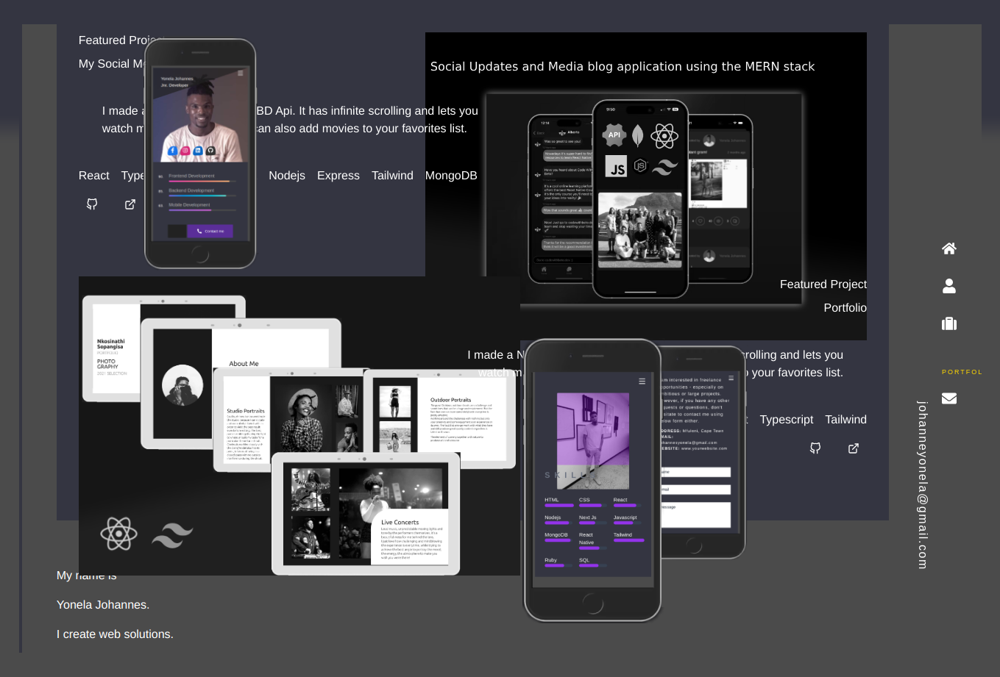

## Hey, I'm Yonela

### I am a Fullstack Developer

### You can check out my portfolio [here](https://yonela-johannes.github.io/yonelajohannes)

### 💻 Tech I use

                 

#### Where to find me

